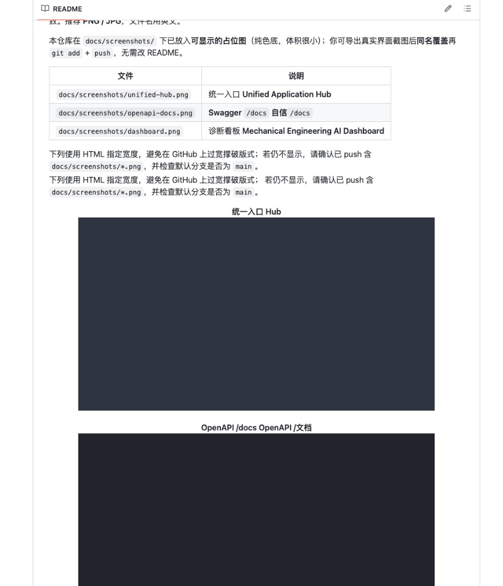

# 机械工程 AI 系统（Mechanical Engineering AI — 演示工程）

本目录是「课程级整包」：**FastAPI 后端** + **静态前端页** + **测试/演示数据** + **文档**。与同级 **`mechanical-ai-platform`**（另一套更小骨架）相互独立。

## 界面预览

README 里**可以**放前端截图：把图片放进本仓库（例如 `docs/screenshots/`），用**相对路径**引用即可，GitHub 会直接在仓库首页渲染。

**建议**：用 **PNG / JPG**，文件名尽量**英文**（如 `unified-hub.png`），避免少数工具对路径编码不友好。截图分辨率宽度约 **1200～1600px** 在网页上较清晰；若单张很大，可压缩后再提交以控制仓库体积。

将文件保存到 `docs/screenshots/` 下后，与下表文件名一致即可显示；也可改名，并同步修改下面 Markdown 中的路径。

| 截图文件（示例） | 说明 |
|------------------|------|
| `docs/screenshots/unified-hub.png` | 统一入口 **Unified Application Hub** |
| `docs/screenshots/openapi-docs.png` | **Swagger** `/docs` 接口文档 |
| `docs/screenshots/dashboard.png` | 诊断看板 **Mechanical Engineering AI Dashboard** |

示例写法（复制到 README 任意位置均可）：

```markdown


```

添加截图文件并 `git push` 后，下列引用会显示为图片（文件尚不存在时 GitHub 上会显示裂图，可忽略直至你补全 PNG）：


---

## 推荐目录结构（当前）

```
机械工程AI系统/
├── README.md                 # 本说明（入口导航）
├── main_app.py               # FastAPI 主程序（默认端口 8010）
├── deploy_package.py         # 部署相关脚本
├── demo_scenarios.py         # 演示场景数据生成器（会写 demo_data.json）
├── test_suite.py             # HTTP 集成测试（需先启动 main_app）
├── requirements.txt          # 运行 main_app 的依赖
├── requirements-test.txt     # 测试依赖（httpx、pytest 等）
├── Dockerfile                # API 镜像
├── docker-compose.yml        # API + Postgres + Redis + Nginx 前端
├── docker/nginx-frontend.conf
├── .dockerignore
├── .env.docker.example       # Compose 环境变量示例
│
├── docs/                     # 📄 说明文档（原根目录散落 .md 已归集）
│   ├── screenshots/          # 📷 README 界面截图（PNG/JPG，见上文「界面预览」）
│   ├── COMPLETE_PROJECT_INTEGRATION.md
│   ├── 测试指南.md
│   └── 演示测试快速指南.md
│
├── examples/                 # 📋 可直接用于 API 的示例 JSON
│   └── diagnosis_submit_bearing.json
│
├── postman/                  # 📮 Postman 集合（JSON，导入 Postman/Apifox）
│   └── Mechanical-Engineering-AI-System.postman_collection.json
│
├── 前端/                     # 🖥 静态 HTML（建议用 http.server 打开，避免 file:// 限制 iframe）
│   ├── Unified Application Hub.html    # 统一入口（卡片打开各子页）
│   ├── Mechanical Engineering AI Dashboard.html
│   ├── Knowledge Base Search Frontend.html
│   ├── Multi-Agent Execution Frontend.html
│   ├── User Authentication Frontend.html
│   └── Analytics Dashboard Frontend.html
│
└── logs/                     # 运行 main_app 时可能生成（可加入 .gitignore）
    └── app.log
```

---

## 怎么跑（最短路径）

| 目的 | 做法 |
|------|------|
| 起后端 | `cd 机械工程AI系统 && python main_app.py`（端口占用时设 `MAIN_APP_PORT`） |
| 看接口文档 | 浏览器打开 `http://127.0.0.1:8010/docs` |
| 跑自动化测试 | 另开终端：`python test_suite.py`（`TEST_BASE_URL` 与端口一致） |
| 打开统一前端 | `cd 机械工程AI系统/前端 && python3 -m http.server 8080`，再开 `http://127.0.0.1:8080/Unified%20Application%20Hub.html` |
| 生成演示 JSON | `python demo_scenarios.py`（当前目录会生成 `demo_data.json`） |

---

## 与 `mechanical-ai-platform` 的区别（避免混用）

| 项目 | 说明 |
|------|------|
| **机械工程AI系统 / main_app.py** | 本目录；演示型单体；默认 **8010**；Postgres/Redis 可选 |
| **mechanical-ai-platform** | 兄弟目录；Week13 KB + Week18/19/20 骨架；默认 **8000** |

---

## 若还要继续「物理整理」

当前**未改**子 HTML 文件名（含空格），以免你已收藏的路径失效。若要更清爽，可后续统一改为短名（如 `hub.html`、`dashboard.html`）并同步改 `Unified Application Hub.html` 里的 `MODULE_HTML` 映射。

---

## 这是「完整」的生产代码吗？

**不完全是，要分清两层意思：**

| 维度 | 说明 |
|------|------|
| **能本地跑演示** | 可以。`main_app.py` + `/docs` + `test_suite.py` + `前端/` 静态页能串起教学演示。 |
| **商业上线级「完整」** | 还不到。大量接口是**模拟返回**；认证多为占位；未自带与当前目录一致的 **Dockerfile / K8s**；**Postgres / Redis** 为可选依赖，需你自建或改配置。 |
| **`deploy_package.py`** | 实际是 **Bash 脚本**（扩展名易误解），按「理想化多目录工程 + Docker」模板编写，**与当前「单文件 main_app + 前端 HTML」结构并不一一对应**，不要指望复制粘贴就能一键发布本目录。 |

若你要**严肃上线**，还需要：真实用户与权限、HTTPS、密钥与 `.env` 管理、数据库迁移、监控与日志规范、以及把前端里的 API 地址改成你的生产域名/端口等。

---

## 如何「发布」（最小可行）

### A. 单机 / 内网（最常见）

1. **服务器**安装 Python 3.9+，进入 `机械工程AI系统`：  
   `python3 -m venv .venv && source .venv/bin/activate`  
   `pip install -r requirements.txt`
2. **环境变量**：复制或编写 `.env`（至少改 `JWT_SECRET`、`postgres_url` / `redis_url` 等，见 `main_app.py` 里 `Settings`）。
3. **进程**：生产建议：  
   `uvicorn main_app:app --host 0.0.0.0 --port 8010 --workers 2`  
   （需在 `机械工程AI系统` 目录执行，或把该目录加入 `PYTHONPATH`。）
4. **静态前端**：用 **Nginx**（或 Caddy）把 `前端/` 作为静态根目录，或通过子路径反代；各 HTML 里若写死 `localhost:8000`，需改成你的 **API 域名与端口**（`main_app` 默认 **8010**）。
5. **可选**：前面加 Nginx 做 **HTTPS**、限流、**CORS** 与 `TrustedHostMiddleware` 里的 `allowed_hosts` 改为你的域名。

### B. Docker Compose（本目录已提供）

在 **`机械工程AI系统`** 目录执行：

```bash
docker compose up -d --build
```

默认会起四个服务：**api**（`main_app`）、**postgres**、**redis**、**frontend**（Nginx 托管 `前端/`）。  
可选：复制 `.env.docker.example` 为 `.env` 再改密码与端口。

| 访问 | URL |
|------|-----|
| OpenAPI | http://127.0.0.1:8010/docs |
| 统一 Hub | http://127.0.0.1:8080/Unified%20Application%20Hub.html |

说明：各 HTML 里若仍写死 `http://localhost:8010` 调 API，在宿主机上一般仍可用；若希望**只暴露 8080**，需把前端里的 API 基地址改为同源 **`/api`**（Nginx 已把 `/api/` 反代到 `api:8010`）。

相关文件：`Dockerfile`、`.dockerignore`、`docker-compose.yml`、`docker/nginx-frontend.conf`。

### C. 云平台

任意支持 **Docker** 或 **Python Web** 的 PaaS：把 A/B 中的启动命令配成启动项，环境变量在控制台配置即可。

---

## 依赖文件

| 文件 | 用途 |
|------|------|
| `requirements.txt` | 运行 **main_app** |
| `requirements-test.txt` | 运行 **test_suite.py**（httpx / pytest） |

---

## 推送到 GitHub（只提交本目录）

在 **`机械工程AI系统` 文件夹里**单独建仓库并推送，GitHub 上仓库根目录即为本项目文件（不会带上外层 `机械工程AI学习` 整棵树）。

```bash
cd "/Users/niuniubaba/Documents/机械工程AI学习/代码/new_my_project/机械工程AI系统"

git init
git remote add origin https://github.com/hcbwsw/mechanical-engineering-ai.git
# 若已存在 origin：git remote set-url origin https://github.com/hcbwsw/mechanical-engineering-ai.git

git add .
git status    # 确认无 .env、无大文件误加
git commit -m "Initial commit: mechanical engineering AI system"
git branch -M main
git push -u origin main
```

若外层 **`机械工程AI学习` 也是 Git 仓库**，会出现「目录里还有一个 `.git`」的嵌套情况：外层 `git status` 可能一直显示该目录未跟踪。可选做法：在外层 `.gitignore` 中加一行 `代码/new_my_project/机械工程AI系统/`，表示该子项目由独立仓库维护；或外层不再 `git add` 该路径即可。

推送认证需本机 **PAT** 或 **SSH**，与 GitHub 网页说明一致。
